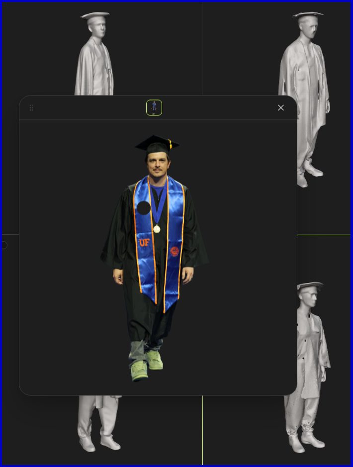
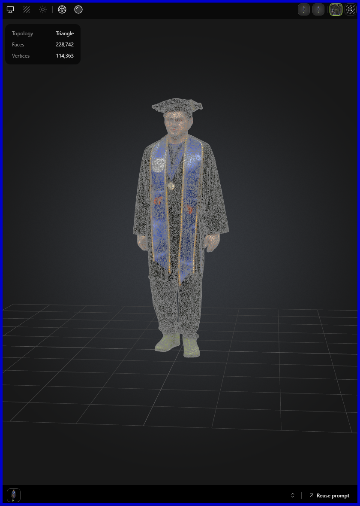

# 🔥 Portfolio Website: Next.js, Tailwind CSS, and Three.js 🔥

View the production deployment: [AlecBytes.com](https://alecbytes.com)

## Portfolio Website Contents

### Pages

- Home
  - Animated navigation buttons.
- About
  - Skill icons.
  - Github statistics.
- Projects  
  - Links to project demos.
- Contact
  - Send me an email.

### Links

- Resume pdf
- Github profile
- LinkedIn profile
- Twitter (X) profile

## Resources Used in This Project

### AI 3D Model

Used [meshy.ai](https://www.meshy.ai) to generate a 3D model and texture based on a picture from my graduation ceremony.

["UF Grad Wizard"](https://www.meshy.ai/3d-models/Graduate-in-Blue-Stole-v2-01953f03-77dc-77eb-9eba-8d092d50f1e6)  

### 3D Models

- ["Magic Book"](https://sketchfab.com/3d-models/magic-book-560340d959d142959fea81b8f262b476)
- ["Wizard Hat"](https://skfb.ly/ozxOQ)
- ["Wizard Staff"](https://skfb.ly/6QYZw)

### AI Images  

- Created with the help of [Playground AI](https://playgroundai.com/)

### Github Stats & Details

- [Github ReadMe Stats](https://github.com/anuraghazra/github-readme-stats)
- [Skills Icons](https://github.com/tandpfun/skill-icons)
- [Github Readme Streak Stats](https://github.com/denvercoder1/github-readme-streak-stats)

### Development Resources

- Fonts from [Google Fonts](https://fonts.google.com/)
- Icons from [Lucide Icons](https://lucide.dev/)
- Notifications from [Sonner](https://sonner.emilkowal.ski/)
- Form created using [react-hook-form](https://react-hook-form.com/)
- Animations using [framer-motion](https://www.framer.com/motion/)
- Emails using [Emailjs](https://www.emailjs.com/)
- Convert 3d models to JSX using [Gltf JSX](https://github.com/pmndrs/gltfjsx)

### Audio

- Music by [Shiden Beats Music](https://pixabay.com/users/shidenbeatsmusic-25676252/?utm_source=link-attribution&utm_medium=referral&utm_campaign=music&utm_content=20772) from [Pixabay](https://pixabay.com/music//?utm_source=link-attribution&utm_medium=referral&utm_campaign=music&utm_content=20772)

---

This is a [Next.js](https://nextjs.org/) project bootstrapped with [`create-next-app`](https://github.com/vercel/next.js/tree/canary/packages/create-next-app).

Based on a tutorial by [freeCodeCamp.org](https://www.youtube.com/watch?v=aZZrEE_UsIk&t=2236s).
