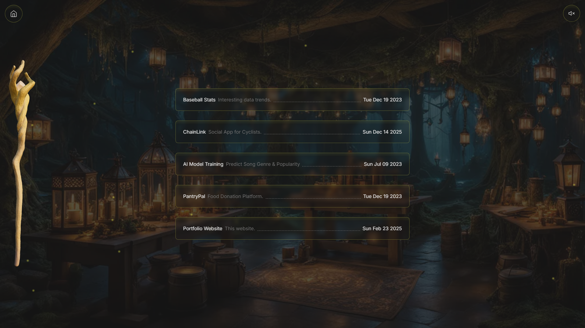

# **Portfolio Website – Built with Next.js, Tailwind CSS & Three.js**  

🚀 **Live Demo:** [AlecBytes.com](https://alecbytes.com)  

---

## ⭐ **Please Star This Project**  ⭐

If you find this project useful, consider **starring** ⭐ the repo! Your support helps others discover it and motivates further development. Thank you! 🙏 

---

## 📌 **Portfolio Website Features**  

### **🌍 Pages & Sections**  

- **Home** → Animated navigation buttons  
- **Resume** → Education, work experience, and skills  
- **About** → Skill icons, GitHub statistics  
- **Projects** → Links to project demos  
- **Contact** → Send me an email  

### **🔗 External Links**  

- 📄 **Resume PDF**  
- 🔗 **GitHub Profile**  
- 🔗 **LinkedIn Profile**  
- 🔗 **Twitter (X) Profile**  

---

## 🎨 **Resources Used in This Project**

### **🤖 AI-Generated Images**  

- Created with the help of [Playground AI](https://playgroundai.com/)  

---

### **🤖 AI-Generated 3D Model**  

Used [meshy.ai](https://www.meshy.ai) to generate a **3D model and texture** based on a picture from my graduation ceremony.  

🎓 **["UF Grad Wizard"](https://www.meshy.ai/3d-models/Graduate-in-Blue-Stole-v2-01953f03-77dc-77eb-9eba-8d092d50f1e6)**  

  
  

### **📦 3D Models Used**  

- **["Magic Book"](https://sketchfab.com/3d-models/magic-book-560340d959d142959fea81b8f262b476)**  
- **["Wizard Hat"](https://skfb.ly/ozxOQ)**  
- **["Wizard Staff"](https://skfb.ly/6QYZw)**  

## 🏗 **Development Resources**  

### **🛠 Tech Stack**  

- **Frontend:** [Next.js](https://nextjs.org/), [Tailwind CSS](https://tailwindcss.com/), [Three.js](https://threejs.org/)  
- **3D Rendering:** [Three.js](https://threejs.org/), [Gltf JSX](https://github.com/pmndrs/gltfjsx)  
- **Animations:** [Framer Motion](https://www.framer.com/motion/)  
- **Forms & Emails:** [React Hook Form](https://react-hook-form.com/), [Email.js](https://www.emailjs.com/)  
- **Notifications:** [Sonner](https://sonner.emilkowal.ski/)  
- **Icons & Fonts:** [Lucide Icons](https://lucide.dev/), [Google Fonts](https://fonts.google.com/)  

### **📊 GitHub Stats & Details**  

- 📈 [GitHub ReadMe Stats](https://github.com/anuraghazra/github-readme-stats)  
- 🎯 [GitHub ReadMe Streak Stats](https://github.com/denvercoder1/github-readme-streak-stats)  
- 🛠 [Skill Icons](https://github.com/tandpfun/skill-icons)  

### **🎵 Audio**  

- **Music by** [Shiden Beats Music](https://pixabay.com/users/shidenbeatsmusic-25676252/?utm_source=link-attribution&utm_medium=referral&utm_campaign=music&utm_content=20772) from [Pixabay](https://pixabay.com/music//?utm_source=link-attribution&utm_medium=referral&utm_campaign=music&utm_content=20772)  

---

## 📷 **Images of the Portfolio Website**

### Home

### Projects

### Contact

### About

### Resume

---

## 🚀 **Project Setup**  

This project is built with [Next.js](https://nextjs.org/) and bootstrapped using [`create-next-app`](https://github.com/vercel/next.js/tree/canary/packages/create-next-app).  

## 🙌 Credits

Inspired by a [freeCodeCamp.org](https://www.youtube.com/watch?v=aZZrEE_UsIk&t=2236s) tutorial.
